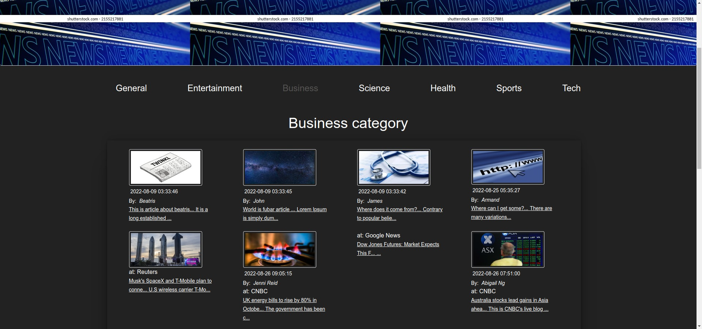

# News Portal App

### Local And Worldwide News

### Created with PHP/Twig/Guzzle

### News added from API https://newsapi.org/

### Complete create, update, delete post function

### Register, login and profile capabilities

-----

-----

-----

-----

-----

# How To Set up:

### ! Requirements:

#### PHP installed on your machine

#### Registered api key from https://newsapi.org/

#### MySql database or any other with tables articles and users
##### articles table fields:
###### id int, not null, Auto inc, Primary key
###### users_id int
###### author varchar(255)
###### title varchar(255)
###### description text
###### content text
###### url varchar(255)
###### urlToImage varchar(255)
###### created_at datetime, CURRENT_TIMESTAMP

##### users table fields:
###### id int, not null, Auto inc, Primary key
###### name varchar(255)
###### surname varchar(255)
###### email text
###### password text
###### created_at datetime, CURRENT_TIMESTAMP

----

#### 1. Register on https://newsapi.org/

#### 2. Clone this git repository or download to your chosen directory

#### 3. Rename .env.example file to .env

#### 3. Fill API_KEY in the .env file you renamed in root directory with api key from step 1

#### 4. Run command to install required packages

~~~~

composer install

~~~~

### 5. Run with command

~~~~

php -S localhost:8080

~~~~

----
